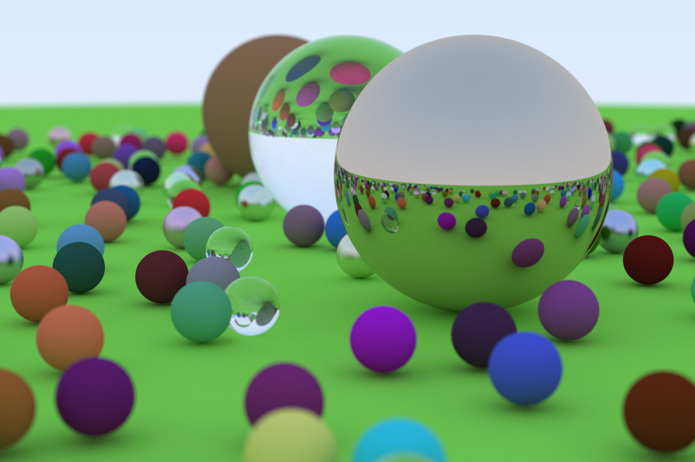

# Whitted-Style-Ray-Tracing
a Whitted-Style Ray Tracing Render.

Features

- stb_image to write png.

- Anti-Aliasing:sample 500 times per pixel .

Material:

- lambertain diffused
- metal 
- glass

Camera：

- Depth of field

