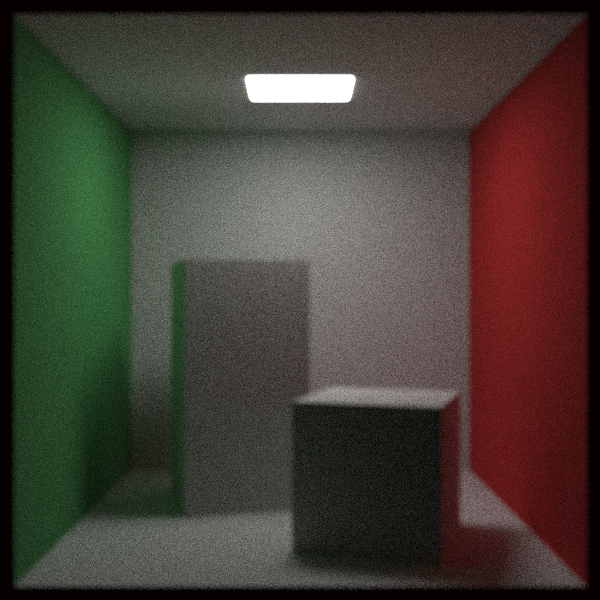
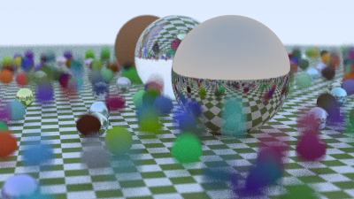
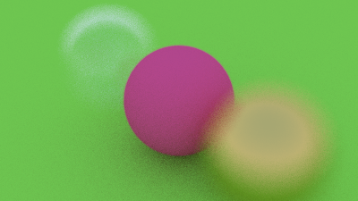
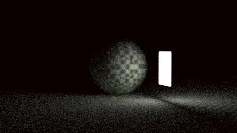

# tiny Ray-Tracing Renderer
A Ray Tracing Render.

## Features

- stb_image to write png
- bvh
- gamma

Material:

- lambertain diffused
- metal 
- glass

Texture：

- solidColor

- checker

  

Camera：

- Depth of field
- Motion blur

Light：

- diffuse meterial

